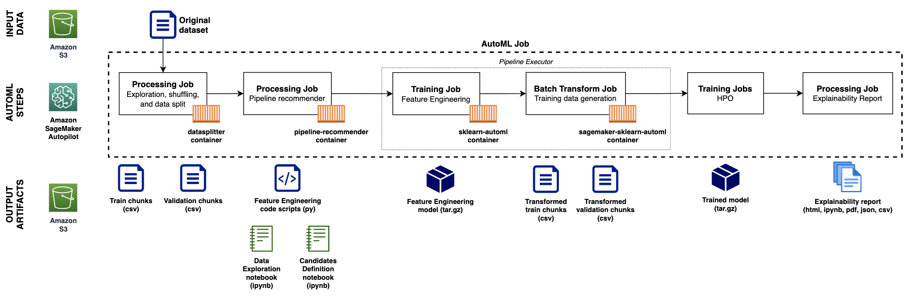

# Extending Amazon SageMaker Autopilot to Custom Code

Amazon SageMaker Autopilot generates a series of artifacts during the AutoML job, allowing you to download, explore, re-use, or customize any part of the Autopilot pipeline.

In this example, we will learn how to re-use these artifacts generated for a given model from an Autopilot job.

The following diagram illustrates in high-level the steps Autopilot follows, and the artifacts generated and stored in Amazon S3 that we are aiming to re-use.

